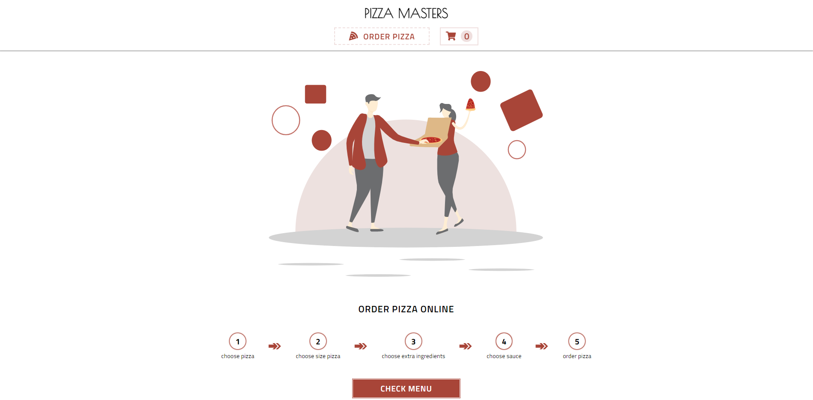
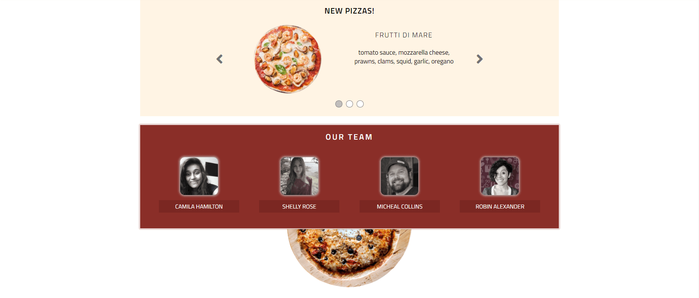
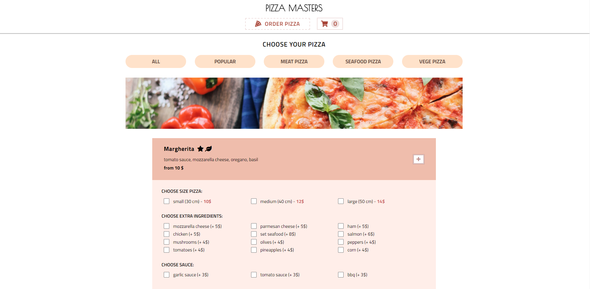
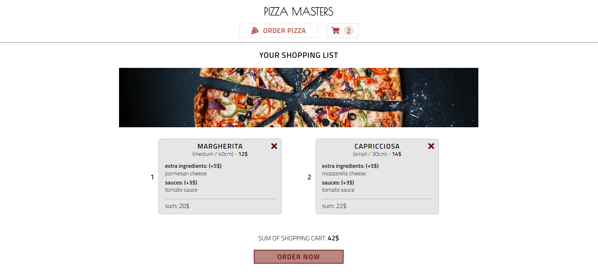

# pizza-masters

> This is my old project (which doesn`t contain aspects I learned from feedback), but shows progress of my skills

#### This is a pizzeria page, where you can order pizza

Link: https://developmeg.github.io/pizza-masters/

---

## Technologies

- React (Create React App)
- React Router
- React Hooks
- Styled Components

#### Extra Packages

- GSAP
- react-transition-group

#### Data (APIs)

- JSON Server (own database)
- Random user generator - [LINK](https://randomuser.me/)

## Installation

Clone this repository and install dependencies: `npm install`

Next run application on your localhost: `npm start`

To build project : `npm run build`
